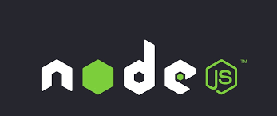

<p align="center">
  <a href="https://nodejs.org/api/https.html" target="blank"></a>
</p>

# Red Social API
1. Clonar el repositorio
2. Instalar la dependencias
```
npm install
```
3. Copiar el archivo .env.template y renombrarlo como .env
4. Llenar las variables de entorno en funcion a la aplicacion
5. Levantar la base de datos en docker
```
docker compose up -d
```
6. Ejecutar la aplicacion en desarrollo
```
npm run dev
```

Nota: Para levantar el contenedor docker de Postgres es necesario tener instalado Docker en su PC y luego ejecutar el programa. 

Docker para Windows:
```
https://docs.docker.com/desktop/install/windows-install/
```

Docker para Linux:
```
https://docs.docker.com/engine/install/ubuntu/
```